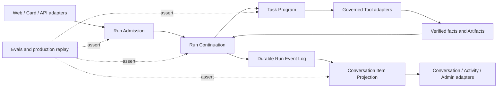

# 纸鸢 Agent 系统架构解决方案

> 状态：已完成领域决策，待进入详细 interface 设计与实施拆解  
> 日期：2026-08-30  
> 范围：Run Admission、Run Continuation、Task Program、Conversation Item Projection、Evals 与迁移发布  
> 依据：生产 E2E 101–120、ADR-0013～0022、`CONTEXT.md`、OpenSpec、PRD 与当前实现扫描

## 1. 结论

当前生产问题不是若干孤立缺陷，而是同一条 Agent 链路存在多个平行事实源：

- 浏览器、正则分类、LLM 分类、Guided Session 和页面特判都能改变任务判定。
- 普通 Turn、Gate 决策、后台任务和人工恢复使用不同续跑协议。
- Run Contract 主要在执行结束后判分，不能阻止模型跳过必做阶段。
- Run Events、Session Messages、页面临时状态和 Gate 消息改写共同决定用户看到什么。
- Memory 与 Postgres adapter 重复实现状态语义，已经出现实际行为漂移。

系统方案不是“重写一个更强的意图分类器”，而是建立四个有顺序依赖的深 module：

1. **Run Admission**：统一 Turn 到 Run 的权威决定。
2. **Run Continuation**：统一 Run 续跑刺激、状态转换和 checkpoint 恢复。
3. **Task Program**：确定性规定任务阶段、能力、验证事实和成功出口。
4. **Conversation Item Projection**：统一从运行事实到用户安全界面的投影。

实现逐步进入 feature flag，生产行为在所有发布门禁通过后统一切换；切换稳定后删除旧链路。

## 2. 已确认的领域决策

本方案中的以下内容已经在 grilling 中确认，不再作为实施阶段的开放问题：

| 决策 | 结论 | 记录 |
| --- | --- | --- |
| Run 入口 ownership | 服务端 Run Admission 是唯一权威；浏览器只提供不可信提示 | ADR-0017 |
| 续跑输入 | Turn、Gate、后台结果和人工恢复进入同一持久 stimulus inbox | ADR-0018 |
| Task 执行深度 | 统一 Task Program interface，区分确定性 Program 与对话型 Program | ADR-0019 |
| 用户界面事实 | UI 读取持久 Conversation Item 投影，不并行相信 Session Messages | ADR-0020 |
| 跨 Run 切换 | 只在安全切换点自动暂停旧 Run；危险点必须先处理当前动作 | ADR-0021 |
| 发布方式 | 代码渐进迁移、生产一次切换、稳定后删除旧路径 | ADR-0022 |

继续遵守既有决策：

- ADR-0013：Run Event 必须投影为用户安全界面。
- ADR-0014：一个明确目标对应一个 Run；多个目标通过 Artifact 在同一 Conversation 串联。
- ADR-0015：使用分层 Eval Run 和确定性发布门禁。
- ADR-0016：保留纸鸢界面，只深化 harness 投影模式。

## 3. 非目标

本轮架构改造不做以下事情：

- 不用新的 LLM 分类器替换全部业务规则后继续让浏览器构造 Run。
- 不把所有 Task 强制套入相同写入流水线。
- 不重做纸鸢 Agent UI 视觉设计。
- 不把多个明确目标塞进同一个 Run。
- 不允许 raw Tool Result、原始推理或系统内部 payload 直接进入用户界面。
- 不长期保留新旧两套运行时语义。
- 不把生产一次切换理解为一次性大爆炸开发。

## 4. 目标架构



### 4.1 Ownership 变化

| 当前 ownership | 目标 ownership |
| --- | --- |
| 浏览器构造 `taskType`、`agentId`、Contract 和 Run | Run Admission 构造权威决定 |
| Memory/Postgres adapter 各自实现业务状态转换 | Run Continuation module 定义语义，store 只适配持久化 |
| 模型决定是否调用必需工具 | Task Program 决定唯一下一阶段，模型只生成阶段内容 |
| 页面从事件、消息和临时状态拼装真相 | Projection module 生成持久 Conversation Item |
| 事后 Contract 判断任务是否成功 | Program 阶段只接受 verified facts 后推进 |

## 5. Module 1：Run Admission

### 5.1 职责

Run Admission 是所有 Conversation Turn 和结果卡动作进入 Agent Runtime 的唯一 seam。它同时完成：

1. 识别主目标，而不是只提取命中关键词。
2. 分离限制条件，例如“不要更新画像”“不要重新评估 Offer”。
3. 解析 Artifact 引用，例如已有 JD、Offer Report、简历版本或面试计划。
4. 判断当前输入属于补充、批准、取消、明确任务切换还是新建 Conversation。
5. 应用合法任务转换图和安全切换点规则。
6. 决定继续当前 Run、创建新 Run、请求澄清、等待安全切换点或拒绝。
7. 选择 Task Program、Agent implementation，并构造权威 Run Contract。
8. 记录可用于 Review 和 Eval 的判定证据。

### 5.2 信任模型

Web、结果卡、工作台和未来外部入口都只是 adapter。

它们可以传递：

- 原始用户 Turn 或结构化用户动作。
- 当前 Conversation 标识。
- 用户明确选择的 Artifact 标识。
- 来源页面、按钮 intent 等不可信提示。

它们不能权威决定：

- `taskType`
- `agentId`
- Run Contract
- allowed tools
- 是否续当前 Run
- 是否新建 Conversation
- 旧 active Run 如何处理

服务端必须重新加载 Conversation、当前 active Run、Artifact 归属和最新版本后再作决定。

### 5.3 Admission 决定类型

| 决定 | 适用场景 | 结果 |
| --- | --- | --- |
| Continue Current Run | 补充当前目标、回答问题、批准或拒绝 Gate | 生成 Continuation Stimulus |
| Start New Run | 当前 Conversation 内出现新的明确目标，且旧 Run 已安全暂停或已终态 | 创建新 Run，传递允许的 Artifact |
| Clarify | 主目标、材料或副作用约束不充分 | 创建或继续对话型 clarification 阶段，不执行写入 |
| Defer Switch | 新目标明确，但旧 Run 未到安全切换点 | 保留 Turn，展示待处理原因，不创建第二个 active Run |
| Reject | Artifact 越权、非法转换或动作与用户身份不匹配 | 不创建/不续跑，并生成安全 Item |
| Start New Conversation | 用户主动新建对话，或独立工作台明确创建专属 Conversation | 创建隔离 Conversation |

### 5.4 意图模型必须分离的维度

Admission 内部可以组合规则、确定性解析和 LLM，但输出不能只是单个分类标签。至少要区分：

- **Primary Goal**：用户真正要完成的目标。
- **Constraints**：禁止写入、只读、范围、格式、时间等限制。
- **Artifact References**：目标依赖的现有事实和版本。
- **Effect Expectation**：只读、引导、写入、导出或高风险动作。
- **Conversation Relation**：补充当前 Run、恢复旧 Run、切换目标或新建 Conversation。
- **Evidence**：判定依据和置信度；低置信度必须进入 clarification。

否定限制不能覆盖 Primary Goal。例如“帮我定位职业方向，但不要更新画像”的 Primary Goal 是职业定位，约束是禁止画像写入；不能路由成 `profile_update`，也不能退化为无任务记录的 `general_chat`。

### 5.5 Offer 结果卡规则

Offer 评估后的谈判、HR 问询和报告解释都是新的明确目标：

- 保留当前 Agent Conversation。
- 绑定既有 Offer Report Artifact。
- 为每个目标创建新的只读 Task Program Run。
- 不重新评估 Offer。
- 不使用 `newSession=1` 隐式创建 Conversation。
- 不把已知 Offer 目标记录为无 Contract 的 `general_chat`。

建议增加明确的 Program 标识：

- `offer_report_explanation`
- `offer_negotiation_guidance`
- `offer_hr_inquiry`

它们属于 Offer 领域，但不是 `offer_evaluation` 的内部阶段。

### 5.6 需要删除或变薄的 implementation

- `src/app/agent/page.tsx` 中的路由二次计算、Run Contract 构造和 Run 创建策略。
- 页面根据 `newSession`、hidden prompt 和来源参数决定领域语义的分支。
- 结果卡直接决定新建 Conversation 的 URL 逻辑。
- Run 创建 route 对客户端 `taskType`、`agentId` 和 Contract 的盲信。
- 多个互相覆盖的正则 Agent 分类、Task 分类和 Guided Session 特判。

这些函数可以保留为 Admission implementation 内的解析器或 adapter，但不能继续拥有最终决定权。

## 6. Module 2：Run Continuation

### 6.1 统一续跑输入

以下输入都称为 Continuation Stimulus，并进入同一有序持久 inbox：

- Conversation Turn
- Run Gate approved / denied
- Background Job succeeded / failed / needs attention
- Manual recovery / resume command

记录 stimulus、消费 stimulus 和完成其触发的执行是三个不同事实。

### 6.2 Stimulus 生命周期

推荐最小生命周期：

1. **recorded**：已经以 request id 幂等持久化。
2. **pending**：等待兼容 checkpoint 和 worker owner。
3. **consumed**：worker 已在 checkpoint 事务中接收，并确定下一执行位置。
4. **rejected**：与 Run、Gate、Artifact 或 checkpoint 不兼容，保留原因和审计证据。

不能在 HTTP 响应成功时直接把 stimulus 标成 consumed。

### 6.3 原子语义

一次 continuation command 必须原子完成：

- request id 幂等检查。
- stimulus 持久化。
- 当前 Run 状态合法性检查。
- 必要的状态转换和 wake time 更新。
- outbox / notify 写入。

worker 消费时必须原子完成：

- fencing token 与 owner 校验。
- checkpoint 兼容性校验。
- stimulus 消费。
- execution cursor / plan stage 更新。
- 下一状态和事件写入。

### 6.4 核心不变量

- stimulus 已 consumed 后，Run 不能因同一等待条件继续 `waiting_user`。
- Gate 已 approved/denied 后，对应 Gate Item 与 Run 状态必须最终一致。
- 同一 request id 重放不能产生第二次副作用。
- 同一 Conversation 同时最多一个 active Run。
- Run 只能从持久 checkpoint 恢复，不能依赖页面消息列表猜测进度。
- Gate 决策只能恢复与该 scope hash 匹配的动作。
- 后台作业结果只能恢复引用该 job id 的 Tool Attempt。
- Memory 和 Postgres adapter 对相同 command trace 产生相同快照、事件和 stimulus 生命周期。

### 6.5 安全任务切换

新目标到达时：

1. Admission 判断它是任务切换，而不是当前 Run 补充。
2. 当前 Run 已在安全切换点：自动进入 `paused`。
3. 在同一 Conversation 创建新 Run，并只转发合法 Artifact。
4. 创建“旧任务已暂停，可恢复”的 Conversation Item。

如果当前 Run 存在以下任一情况，则不能立即切换：

- 不可安全中断或结果不确定的 Tool Attempt。
- 未处理的高风险 Gate。
- 已提交副作用但尚未完成 read-back。

用户必须完成、拒绝或取消当前动作；新目标可以被记录为 defer，但不能形成第二个 active Run。

### 6.6 Store adapter conformance

Run Continuation module 拥有状态语义；Memory 和 Postgres 只实现持久化 adapter。必须建立共享 command trace 测试，至少覆盖：

- waiting_user + Turn
- waiting_user + approved Gate
- waiting_user + denied Gate
- paused + manual resume
- paused + ordinary Turn
- duplicate request id
- stale fencing token
- background job completion
- explicit task switch at safe checkpoint
- task switch while high-risk Gate pending

当前已知差异：Postgres 在 paused 收到 Turn 时会 queued，Memory 只处理 waiting_user。迁移完成前必须消除这类 adapter 语义差异。

## 7. Module 3：Task Program

### 7.1 定位

Task Program 不是新的 Prompt，也不是 Tool 白名单。它拥有一类目标的执行骨架：

- 阶段图
- 每个阶段允许的能力
- 进入/退出条件
- 需要的 Gate
- 必须形成的 verified facts
- Artifact 创建或更新规则
- 用户安全失败出口
- 成功终态条件
- Program 版本和配套 eval suite

Run Contract 是 Program 针对一个具体 Run 和 Artifact 版本实例化后的完成约束。

### 7.2 两种执行深度

#### 确定性 Program

用于需要副作用、验证或 Artifact 的目标。通常包含：

```text
preflight → clarify/gate → execute → verify/read-back → persist artifact → respond
```

阶段可以按任务裁剪，但所有声明为必做的阶段都不能由模型跳过。

#### 对话型 Program

用于只读回答或引导。它仍然需要：

- 正确的上下文和 Artifact 绑定。
- 明确的下一轮 expected input。
- 任务专属成功条件。
- 受控的安全输出和终止条件。

它不需要虚构写入、read-back 或 Artifact 阶段。

### 7.3 Program 分类建议

| Program | 深度 | 必须验证的核心结果 |
| --- | --- | --- |
| general_chat | 对话型 | 明确回答，不能吞掉已知任务目标 |
| career_positioning_guidance | 对话型 | 定位框架、单轮推进、expected input、可选定位 Artifact |
| resume_query | 对话型 | 简历事实源已读取、回答引用正确版本 |
| interview_coaching | 对话型 | JD/简历/计划绑定、题号与回答状态连续、单轮目标正确 |
| offer_report_explanation | 对话型 | 已有 Offer Report 已绑定且未重新评估 |
| offer_negotiation_guidance | 对话型 | 已有 Offer Report 已绑定、谈判输出完整 |
| offer_hr_inquiry | 对话型 | 已有 Offer Report 已绑定、HR 问询清单完整 |
| resume_edit | 确定性 | 草稿、批准、应用、read-back hash、版本快照 |
| jd_evaluation | 确定性 | 来源内容、A–G 评估、报告持久化、读回 |
| offer_evaluation | 确定性 | Offer 内容、评估模块、报告持久化、读回 |
| profile_update | 确定性 | 信号证据、校验、写入、读回 |
| reference_resume_save | 确定性 | 原文、岗位分类、持久化、读回 |
| file_export | 确定性 | 文件存在、非零大小、hash、可下载 Artifact |
| job_search | 确定性 | 条件确认、Gate、scan、机会池读回 |

### 7.4 推进规则

- 模型不能直接设置 Program stage。
- Tool 调用成功不等于阶段成功；必须形成 Program 要求的 verified facts。
- 任意 assistant 文本不能满足确定性 Program 的 effect、persist 或 read-back 条件。
- stage 只由确定性 reducer 根据 verified facts、Gate 和 stimulus 推进。
- 每次阶段变化进入 Run checkpoint 和 Event Log。
- Program 终态由阶段出口决定，不再由页面或 worker 末尾各自重新判分。
- 失败必须区分可恢复等待、永久失败和安全暂停。

### 7.5 首批纵切顺序

1. **JD Evaluation**：已有 106/107，覆盖来源、生成、持久化和报告读回。
2. **File Export**：已有 113/114，成功标准高度确定。
3. **Job Search**：已有 115/116，覆盖 clarification、Gate、后台执行和读回。
4. **Resume Edit**：复用成熟 Gate 和 verified write，但需迁移复杂草稿生命周期。
5. **Interview Coaching**：解决回答消费、题号推进和上下文连续性。
6. 其余 Task 逐类迁移。

每迁移一个 Program，就删除该 Task 在页面、worker、Contract 判分和 prompt 中对应的阶段特判，禁止只新增新层而保留旧 ownership。

## 8. Module 4：Conversation Item Projection

### 8.1 事实来源

Projection module 只从以下事实构建用户界面：

- Durable Run Events
- Run Gate 生命周期
- verified Artifact 引用和版本
- 用户 Conversation Turn

Session Messages 是迁移期兼容 read model，不再是平行事实源。

### 8.2 Item 类型

建议的稳定类型：

- `user_turn`
- `assistant_text`
- `run_progress`
- `safe_tool_status`
- `artifact_card`
- `run_gate`
- `task_switch_notice`
- `run_terminal`
- `user_safe_error`

每个 Item 至少拥有：

- 稳定 item id
- Conversation id
- 可选 Run id / Event cursor / Artifact ref
- type 与 schema version
- display state
- created / updated time
- dedupe key
- 用户安全 payload

### 8.3 投影不变量

- 相同 Run Event 重放不能生成重复 Item。
- Gate Item 在批准、拒绝或过期后必须更新原 Item，不新增冲突卡片。
- 实时订阅与刷新读取必须得到相同 Item 顺序和终态。
- 任何 raw Tool Result、系统提示词、Skill 正文、工具参数或原始推理都不能成为 fallback。
- Artifact 卡片只引用通过归属和版本校验的 Artifact。
- assistant_text 只在对应 Program 阶段允许对用户发布时出现。
- Run 失败不能静默保留“已完成”卡片。

### 8.4 Adapter

同一 Item read model 支持：

- Agent Conversation 主界面
- 过程状态轨道
- Admin Agent Evidence
- Eval evidence viewer

各 adapter 可以选择展示不同 Item 类型，但不得各自重新解释 raw events。

### 8.5 需要删除或变薄的 implementation

- `agent/page.tsx` 中 Run Event 到消息的手工拼装。
- Gate response 后页面直接改写历史消息。
- 通过反复刷新 Session Messages 获取最终正文的逻辑。
- `AgentChat.tsx` 中根据大量 raw `uiPayload.type` 决定业务真相的分支。
- Admin Evidence 与用户界面各自实现的事件脱敏和状态映射。

保留并深化 `surface-projection.ts`、`run-event-projection.ts` 和 `item-projection.ts`，不另建第四套投影 implementation。

## 9. 跨 module 不变量

以下条件必须成为数据库约束、确定性检查或发布门禁，不能只写在 Prompt：

1. 一个明确目标对应一个 Agent Run。
2. 同一 Conversation 同时最多一个 active Run。
3. 只有用户主动新建对话或独立工作台专属入口才能新建 Conversation。
4. 明确已知目标不能记录为无 Contract 的 `general_chat`。
5. Run Contract 和 Task Program 由服务端事实构造。
6. Continuation Stimulus 的记录、消费和执行完成可独立审计。
7. 确定性 Program 没有 verified effect / read-back / Artifact 时不能 succeeded。
8. 已 consumed 的等待输入不能留下相同等待条件。
9. approved/denied Gate 必须与 Run 和 Conversation Item 终态一致。
10. 用户界面只消费安全投影，不能读取 raw execution payload。
11. Artifact 跨 Run 传递必须通过合法任务转换图并验证 owner、version 和 stale 状态。
12. Memory/Postgres adapter 必须通过同一 conformance suite。

## 10. Eval 体系

所有本次生产实测中有价值的问题都必须进入 evals。Eval 不只检查回答文本，而要检查每层事实。

### 10.1 Layer A：Admission fixtures

输入：Conversation、active Run、Turn、Artifact refs、entry hints。  
断言：Primary Goal、Constraints、Artifact binding、effect expectation、continue/new Run/new Conversation 决定、审计证据。

必须覆盖：

- “职业定位，但不要更新画像”。
- “生成安全简历修改提案，不要直接写入”。
- 模拟面试回答中出现“JD 要求”。
- Offer Report → HR 问询/谈判/解释。
- 非语义输入、模糊追问和明确任务切换。

### 10.2 Layer B：Continuation command traces

对 Memory 与 Postgres adapter 执行相同命令序列，比较：

- Run snapshot
- Event 序列
- Stimulus 状态
- Gate 状态
- checkpoint / cursor
- notify / wake 结果

任何差异都是 hard failure。

### 10.3 Layer C：Task Program simulations

为每个 Program 构造 verified fact 序列，断言合法与非法阶段推进：

- 缺少必做 fact 时不能跳阶段。
- Tool 返回 success 但 read-back 失败时不能 succeeded。
- duplicate Tool Attempt 不重复推进。
- clarification / Gate 后只能从对应阶段继续。
- terminal Run 不能接受新的阶段推进。

### 10.4 Layer D：Projection snapshots

从固定 Event/Gate/Artifact fixture 生成 Conversation Items，验证：

- 顺序稳定。
- 幂等重放。
- Gate 原位更新。
- 实时与刷新一致。
- 脱敏 allowlist。
- 无 raw payload fallback。

### 10.5 Layer E：Runtime E2E

使用真实 Postgres schema、真实 worker 和 stubbed deterministic model/tool，验证：

- Admission → Run 创建/续跑。
- stimulus inbox → checkpoint 恢复。
- Program 完整阶段。
- Artifact 持久化与读回。
- Event → Conversation Item。

### 10.6 Layer F：浏览器短链路

每个纸鸢能力至少完成一次独立用户旅程，必须检查：

- 登录用户身份和 owner scope。
- Conversation 是否符合预期。
- 是否产生正确 Run 记录。
- Task Program 和 Agent 是否正确。
- Tool / Gate / Artifact 是否真实执行。
- Run 终态与用户 Item 是否一致。
- 刷新后结果是否保持。

### 10.7 Layer G：浏览器长链路

至少覆盖：

- 职业定位 → 画像更新或拒绝写入 → 岗位发现。
- 岗位发现 → JD 评估 → 简历查询/修改 → 面试辅导。
- Offer 评估 → 报告解释 → 谈判建议 → HR 问询。
- 等待用户 → 断网/刷新 → 补充 Turn → 同 Run 续跑。
- 高风险 Gate → 批准/拒绝 → read-back → 投影更新。
- 任务安全切换 → 旧 Run 暂停 → 新 Run 完成 → 旧 Run 恢复。

### 10.8 Layer H：生产失败回放

| Session | 失败簇 | 主要 module | 发布断言 |
| --- | --- | --- | --- |
| 101/102 | 职业定位被否定写入覆盖 | Admission | Primary Goal 为职业定位，Constraint 禁止画像写入 |
| 104/105 | 安全提案误路由查询 | Admission / Program | `resume_edit` 草稿阶段，不执行未批准写入 |
| 109/110 | 面试回答被 JD 关键词劫持 | Admission | 继续当前面试 Run |
| 117 | UX 可用但 Run 记 general_chat | Admission | 每轮绑定 career positioning Program |
| 106/107 | JD Task 选对但无报告 | Task Program | 报告 persist + read-back 后才成功 |
| 113/114 | 导出 Task 选对但无文件 | Task Program | 文件存在、非零、hash verified |
| 115/116 | 岗位发现无确认/扫描/读回 | Task Program / Continuation | Gate、scan、机会池读回完整 |
| 111 | Turn consumed 仍 waiting_user | Continuation | stimulus 消费与等待条件原子消除 |
| 120 | Gate approved 仍 waiting_user | Continuation | Gate、Run、Item 终态一致 |
| 118 | 面试回答后重开第 1 题 | Program / Continuation | 题号与回答 checkpoint 连续 |
| 112/119 | 同类保存请求行为不一致 | Admission / Program | 相同输入和上下文产生一致 Program |
| 108 | Offer → HR 同 Conversation 正确 | Admission / Projection | 作为正向 guardrail 永久保留 |

## 11. 确定性发布门禁

以下任一条件失败，禁止生产切换：

- Admission goldens 未全量通过。
- Memory/Postgres command trace 存在差异。
- 任一确定性 Program 可以在缺少 verified facts 时 succeeded。
- 任一明确目标没有 durable Run 记录。
- 同一 Conversation 出现两个 active Run。
- input consumed 后仍保留相同 waiting condition。
- Gate 终态与 Run/Item 不一致。
- Artifact 不存在、为空、hash 不一致或 owner/version 错误。
- 实时 Item 与刷新 Item 不一致。
- 101–120 任一生产回放回归。
- 任一能力短链路失败。
- 任一核心跨任务长链路失败。
- 用户安全投影出现 raw result fallback。

质量 Judge 只能评价内容质量，不能覆盖以上确定性失败。

## 12. 迁移与发布计划

### Phase 0：冻结与基线

- 冻结意图、Task 执行和 Gate 恢复类局部补丁。
- 只修无争议 UI、认证和与新架构无关的小问题。
- 把 101–120、短链路和长链路固化为当前失败基线。
- 为所有新 schema 和决定建立版本号。

退出条件：问题清单、golden fixtures 和 hard gates 可重复运行。

### Phase 1：Run Admission shadow mode

- 服务端实现 Admission decision，但暂不控制生产执行。
- 记录旧决定与新决定的差异、证据和预期 Run 行为。
- 修正规则和 fixture，不通过逐条页面特判追平。
- 加入 Offer follow-up 专属 Program。

退出条件：生产回放和短链路 Admission goldens 全量通过，差异已分类。

### Phase 2：Run Continuation kernel

- 统一 stimulus schema 和生命周期。
- 把状态转换、幂等、checkpoint 匹配和 wake 语义从 store adapter 提升到 module。
- Memory/Postgres 使用共享 conformance suite。
- 迁移 Turn、Gate、后台作业和人工恢复。

退出条件：command trace 零差异，111/120/118 等续跑回放通过。

### Phase 3：Task Program 纵切

按 JD → 导出 → 岗位发现 → 简历修改 → 面试 → 其余任务推进。

每个 Program 的完成定义：

- 阶段图和 verified facts 已固化。
- runtime simulation 通过。
- 对应浏览器短链路通过。
- 生产失败回放通过。
- 旧 task-specific 特判已删除。

### Phase 4：Conversation Item dual-write

- 现有 Session Message 继续供生产 UI 使用。
- 新 Projection 同时写 Conversation Items，仅在测试/Admin 对比。
- 比较实时顺序、刷新结果、Gate 终态、Artifact 卡片和脱敏结果。
- 逐步让 UI adapter 读取 Items，但保持 feature flag 关闭。

退出条件：同一 journey 的 legacy view 与 Item view 语义一致，新 view 无重复、缺失或泄漏。

### Phase 5：全量预生产 E2E

- 使用真实认证、Postgres、worker、部署配置和外部依赖策略。
- 跑完整能力短链路。
- 跑全部组合长链路。
- 跑 101–120 生产回放。
- 跑 fault injection：断网、worker 重启、重复请求、lease 过期、Gate 重放、后台任务延迟。

退出条件：所有确定性门禁通过，质量 Judge 达标，无未解释差异。

### Phase 6：一次生产切换

- 统一开启 Admission、Continuation、Task Program 和 Item read model。
- 执行一次整体部署，不按 module 分批暴露混合行为。
- 使用 canary 用户/流量监控 Run 创建率、waiting_user 停留、Gate 恢复、Program 失败和投影差异。
- 保留短时可回退 feature flag，但不允许新旧路径长期并存。

### Phase 7：删除 legacy

稳定后删除：

- 浏览器 Run 编排和 Contract 构造。
- client-side task execution loop 的生产入口。
- store adapter 中重复业务状态语义。
- 事后 Contract 多份判分。
- Session Messages 作为 Agent UI 事实源的路径。
- 页面 Gate 改写、hidden bootstrap prompt 和 raw payload 卡片分支。
- 已迁移 Task 的旧 Prompt/Tool/page stage 特判。

## 13. 代码影响范围

### Run Admission

- `src/app/agent/page.tsx`
- `src/lib/agent/task-routing.ts`
- `src/lib/agent/guided-session-state.ts`
- `src/lib/agent/write-intent.ts`
- `src/lib/agent/classify-intent-llm.ts`
- `src/lib/agent/task-journey.ts`
- `src/app/api/agent/runs/route.ts`
- Offer/JD/Resume/Interview handoff adapters

### Run Continuation

- `src/lib/agent/runtime/durable-agent-run.ts`
- `src/lib/agent/runtime/postgres-agent-run-store.ts`
- `src/lib/agent/runtime/state-machine.ts`
- `src/lib/agent/runtime/durable-orchestrator-engine.ts`
- Run input / Gate / pause / resume routes
- Worker claim、checkpoint 和 wake 逻辑

### Task Program

- `src/lib/agent/task-contract.ts`
- `src/lib/agent/tool-governance.ts`
- `src/lib/agent/task-journey.ts`
- `src/lib/agent/loop/server-runner.ts`
- `src/lib/agent/runtime/durable-orchestrator-engine.ts`
- task-specific tools、validators 和 Artifact adapters

### Conversation Item Projection

- `src/lib/agent/runtime/run-event-projection.ts`
- `src/lib/agent/surface-projection.ts`
- `src/lib/agent/item-projection.ts`
- `src/lib/agent/sessions.ts`
- `src/app/agent/page.tsx`
- `src/components/agent/AgentChat.tsx`
- Admin Evidence / Eval Evidence adapters

## 14. 实施拆解原则

- 每个实施 issue 必须对应一个 module ownership 变化或一个可删除的 legacy 路径。
- 不接受“新增 facade，但旧调用者仍可绕过”的完成状态。
- 新 interface 必须有 Memory/Postgres 或 Web/Admin adapter conformance 测试。
- 任何 Task Program issue 必须同时包含阶段模拟、浏览器短链路和失败回放。
- 每个 feature flag 必须写明删除条件和最晚删除阶段。
- 不能以工作区当前测试通过代替预生产真实浏览器 E2E。
- 不能部署单个体系 module 的生产行为，直到四个 module 的统一切换门禁通过。

## 15. 下一步交付物

按顺序生成以下实施文档：

1. Run Admission 详细 interface、决策表和 shadow evidence schema。
2. Continuation Stimulus schema、状态转换表和 adapter conformance contract。
3. Task Program registry、阶段 reducer 与首批三个 Program 定义。
4. Conversation Item schema、投影 reducer 与迁移 dual-write 方案。
5. 数据库 migration 和 feature flag 设计。
6. 分层 eval manifest、101–120 fixtures 和浏览器 journey manifest。
7. 可独立领取的实施 issue 列表与依赖图。

只有这些设计通过评审后，才开始主干实现。
