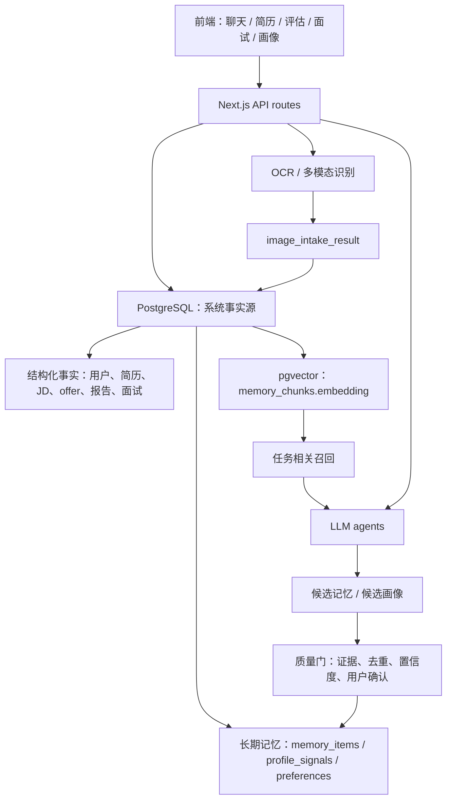

# PostgreSQL + pgvector 长期记忆迁移方案

日期：2026-06-03

## 结论

建议迁移到 PostgreSQL + pgvector，但不要把它理解成“换一个数据库”。这个项目真正要升级的是数据沉淀和 agent 记忆系统：

- PostgreSQL 做系统事实源，负责用户、简历、JD、offer、报告、面试、画像、会话、权限和审计。
- pgvector 做语义检索层，负责从简历、JD、报告、面试回答、历史对话里召回相关上下文。
- JSONB 做 AI 结构化输出缓冲区，保存 OCR、LLM 抽取、A-G 报告块、offer 模块、画像候选项等半结构化内容。
- 画像和长期记忆不能直接从向量库“猜出来”，必须有证据、置信度、来源、去重、归一、用户确认或多次验证。

## 自审修订

原方案方向成立，但不能作为一个大 change 执行。自审发现以下需要修正的地方：

- 数据库基础设施、SQLite 迁移、应用切库、向量记忆、画像质量、agent 接入必须拆成多个 change，否则单次变更风险过大，也不方便回滚。
- `vector(1024)` 只能作为示例，最终维度必须由选定 embedding 模型决定，并且同一张向量表不能混写不同维度。
- HNSW 索引不应该在第一天强行上线，应先完成基础召回和数据量评估，再按查询延迟和数据规模加索引。
- SQLite -> PostgreSQL 迁移和应用切库应分开：先迁移并校验数据，再让 API 切到 PostgreSQL。
- Dexie/localStorage 的定位必须明确改成前端缓存或离线草稿，不能继续承担多人局域网环境下的事实源。
- 画像质量问题不能等向量库接入后再修；必须有候选记忆、证据绑定、质量门和用户确认，避免脏记忆被永久沉淀。

## 竞品调研摘要

### Teal

Teal 的主线是 job tracker + resume builder + job insights。它强调浏览器插件保存职位、岗位阶段管理、JD 关键词/技能洞察、针对 JD 定制简历和匹配评分。

对本项目的启发：

- JD 不是一次性输入，而是求职 pipeline 的长期资产。
- 每个 JD 应该被拆成关键词、技能、职责、公司、岗位、薪资、风险信号、投递状态。
- 报告结果要反哺后续简历优化和面试准备。

来源：https://www.tealhq.com/tools/job-tracker

### Huntr

Huntr 的主线是 job tracker + AI resume builder + tailored resume + autofill。它会保存 JD、薪资、地点、联系人、面试安排，并从 JD 中抽取关键词、职责和任职资格，再和简历做匹配评分。

对本项目的启发：

- 不能只做关键词抽取，应该拆成 responsibilities、qualifications、skills、keywords 四类。
- 每个匹配结论都要知道来自 JD 哪一句、来自简历哪一段。
- 建议采用“候选项 -> 证据 -> 置信度 -> 入库”的画像成长机制。

来源：https://huntr.co/

### Simplify

Simplify 的核心表述是 one profile：一个求职画像用于职位匹配、自动填表、简历定制、申请追踪。它还强调偏好和 dealbreakers，例如薪资、地点、岗位类型。

对本项目的启发：

- 长期记忆的中心不是聊天记录，而是 user career profile。
- agent 每次执行前应该先读用户画像、目标、约束和最近求职上下文。
- “用户明确偏好”和“系统推断偏好”要分开存储，避免 agent 越用越偏。

来源：https://simplify.jobs/

### Careerflow

Careerflow 是 all-in-one career copilot：简历、岗位匹配、自动投递、LinkedIn 优化、mock interview、job tracker。

对本项目的启发：

- 面试、简历、JD 评估、offer 评估不是孤岛，应该共用同一个数据底座。
- mock interview 的题目必须绑定 JD、简历、报告缺口和历史答题表现。

来源：https://www.careerflow.ai/

### Jobscan

Jobscan 更偏 ATS 检测。它强调用 JD 对照简历，输出匹配率、缺失关键词、格式问题、板块分析、行业术语、硬技能和软技能。

对本项目的启发：

- 技能提取要区分硬技能、软技能、行业术语、工具、方法论、岗位职责。
- 抽取项必须来自 JD 或简历的完整短语，不能截半句。
- 画像页不应该显示低价值碎片，如“业务”“技术”“的技术方案”。

来源：https://www.jobscan.co/resume-scanner

## 当前项目数据层观察

当前项目已经存在三套数据路径：

- 服务端 SQLite：`src/lib/server-db.ts` + `src/lib/server-schema.sql`，已有 users、applications、reports、jds、profiles、profile_signals、sessions、cv_data、offers、offer_reports、stories、agent_preferences、session_memory 等表。
- 前端本地存储：`src/lib/db.ts` Dexie，以及 CV、agent memory 相关 localStorage fallback。
- agent 记忆抽象：`src/lib/agent/memory.ts` 和 `src/lib/agent/memory/*` 已经有 working、episodic、semantic、coordinator 的分层雏形，但还没有统一落到可检索、可审计的服务端主库。

迁移重点不是把 SQLite SQL 翻译成 PostgreSQL SQL，而是统一事实源，避免同一份简历、同一个报告、同一段画像信号在 SQLite、Dexie、localStorage、agent memory 里各存一份。

## 目标架构



## 推荐数据模型

### 1. 系统事实表

保留并 PostgreSQL 化：

- `users`
- `applications`
- `jds`
- `reports`，后续可改名或新建 `jd_reports`
- `offers`
- `offer_reports`
- `sessions`
- `cv_data`
- `reference_resumes`
- `stories`
- `agent_preferences`

PostgreSQL 版本要补齐：

- 所有私有数据表必须有 `user_id NOT NULL`
- 时间字段统一用 `timestamptz`
- JSON 字段统一用 `jsonb`
- 外键按真实主键建，不再混用 `reports.id` 和 `reports.report_num`
- `company + role` 不能全局唯一，应该改为 `UNIQUE(user_id, company, role)` 或使用 `source_hash`

### 2. 记忆事实表

新增：

```sql
CREATE TABLE memory_items (
  id uuid PRIMARY KEY,
  user_id uuid NOT NULL REFERENCES users(id),
  memory_type text NOT NULL,
  canonical_text text NOT NULL,
  status text NOT NULL DEFAULT 'candidate',
  confidence numeric NOT NULL DEFAULT 0.5,
  importance numeric NOT NULL DEFAULT 0.5,
  source_count integer NOT NULL DEFAULT 1,
  metadata jsonb NOT NULL DEFAULT '{}',
  created_at timestamptz NOT NULL DEFAULT now(),
  updated_at timestamptz NOT NULL DEFAULT now(),
  last_used_at timestamptz
);
```

`memory_type` 建议先限制为：

- `skill`
- `experience`
- `preference`
- `goal`
- `constraint`
- `interview_pattern`
- `jd_pattern`
- `offer_preference`
- `risk_signal`

### 3. 记忆证据表

新增：

```sql
CREATE TABLE memory_evidence (
  id uuid PRIMARY KEY,
  user_id uuid NOT NULL REFERENCES users(id),
  memory_item_id uuid REFERENCES memory_items(id),
  source_type text NOT NULL,
  source_id text NOT NULL,
  quote text NOT NULL,
  extraction_method text NOT NULL,
  confidence numeric NOT NULL DEFAULT 0.5,
  created_at timestamptz NOT NULL DEFAULT now()
);
```

这张表用于解决画像乱抽的问题。任何画像项必须能点回证据。

### 4. 向量 chunk 表

新增：

```sql
CREATE TABLE memory_chunks (
  id uuid PRIMARY KEY,
  user_id uuid NOT NULL REFERENCES users(id),
  source_type text NOT NULL,
  source_id text NOT NULL,
  chunk_type text NOT NULL,
  chunk_text text NOT NULL,
  embedding_model text NOT NULL,
  embedding vector(1024),
  metadata jsonb NOT NULL DEFAULT '{}',
  created_at timestamptz NOT NULL DEFAULT now()
);
```

`vector(1024)` 只是示例，最终维度必须跟选定 embedding 模型一致。上线前先固定一个 embedding 模型，不要多模型混写同一列。

后续数据量大后再加 HNSW 索引：

```sql
CREATE INDEX memory_chunks_embedding_hnsw
ON memory_chunks
USING hnsw (embedding vector_cosine_ops);
```

## 长期记忆运行机制

### 写入链路

1. 保存原始事实：聊天、OCR、JD、offer、简历、报告、面试回答。
2. 生成候选记忆：只生成候选，不直接进入正式画像。
3. 质量过滤：
   - 文本长度低于 2 个有效词拒绝。
   - 包含断句、半句话、寒暄、工具输出残片拒绝。
   - 来源不是 JD、简历、offer、面试回答、用户明确偏好的低置信度。
   - 泛词拒绝，例如“业务”“技术”“能力”“负责”“方案”。
4. 归一化：
   - `YOLOv8`、`计算机视觉`、`目标检测`可以成为技能簇。
   - `数据经营项目`、`BI项目`、`数据产品`属于业务/产品经验簇。
5. 绑定证据。
6. 更新置信度。
7. 只有高置信度或用户确认后进入正式画像。

### 召回链路

每次 agent 运行前：

1. 根据任务类型确定召回范围。
   - JD 评估：简历、目标岗位、历史 JD 报告、风险偏好。
   - offer 评估：薪资偏好、通勤、城市、公司风险、过往 offer。
   - 模拟面试：当前 JD、当前简历、报告缺口、历史答题弱点。
   - 简历优化：当前简历、目标 JD、参考简历、用户写作偏好。
2. 先读结构化事实，再用 pgvector 召回语义相关 chunk。
3. 对召回结果做 rerank：
   - 同用户优先。
   - 当前任务同类型优先。
   - 近 90 天优先。
   - 用户确认记忆优先。
   - 有证据和高置信度优先。
4. 将召回结果压缩成 agent context，不把整库塞给模型。

## SQLite 迁移路线

### Phase 0：冻结现状和备份

- 备份 `data/zhiyuan.db`。
- 记录当前 SQLite schema。
- 导出每张表行数。
- 跑现有测试，拿到迁移前 baseline。

### Phase 1：PostgreSQL 基础设施

- 增加 `DATABASE_URL`。
- 本地用 Docker 启动 PostgreSQL + pgvector。
- 添加 `src/lib/pg.ts` 或 `src/lib/server-db-postgres.ts`。
- 先不替换业务逻辑，只验证连接、事务、JSONB、vector extension。

### Phase 2：建 PostgreSQL schema

- 将现有 SQLite 表迁成 PostgreSQL 表。
- 修正 user_id、时间字段、唯一约束、JSONB、外键。
- 新增 `memory_items`、`memory_evidence`、`memory_chunks`。
- 保留兼容视图或 adapter，减少一次性改动。

### Phase 3：一次性迁移脚本

新增脚本建议：

- `scripts/migrate-sqlite-to-postgres.mjs`
- `scripts/check-postgres-migration.mjs`

迁移顺序：

1. `users`
2. `profiles` / `cv_data`
3. `applications`
4. `reports`
5. `jds`
6. `offers`
7. `offer_reports`
8. `sessions`
9. `stories`
10. `profile_signals`
11. `agent_preferences`
12. `session_memory`
13. `reference_resumes`

校验：

- 每张表行数一致。
- 关键表抽样比对 JSON 内容。
- 每个用户只能读到自己的数据。
- 报告编号、JD-report 关联、offer-report 关联不丢。

### Phase 4：应用读写切换

- 先做 repository adapter：业务 API 调用统一 DB 接口，而不是直接依赖 better-sqlite3。
- 增加环境变量 `DB_DRIVER=sqlite|postgres`。
- 默认仍可用 SQLite，局域网部署切到 Postgres。
- 所有新写入先走 Postgres。
- 稳定后移除 Dexie/localStorage 作为事实源，只保留前端缓存。

### Phase 5：embedding pipeline

- 对以下内容切 chunk：
  - 简历全文和版本
  - 参考简历
  - JD 正文
  - JD A-G 报告摘要和完整块
  - offer 报告
  - 面试问题与用户回答
  - 高质量画像记忆
- 每次原文更新后异步生成 embedding。
- embedding 失败不阻塞主流程，但必须记录失败原因和可重试状态。

### Phase 6：画像质量重做

- 废弃“从对话里自由抽词直接入画像”的路径。
- 新增 `profile_signal_candidates` 或复用 `memory_items(status='candidate')`。
- 增加质量门：
  - 完整短语校验
  - stopword / 泛词过滤
  - 来源类型权重
  - 证据最小长度
  - 同义归并
  - 重复合并
  - 用户确认状态
- 画像页默认只展示正式记忆，候选记忆放入“待确认”区域。

### Phase 7：agent 长期记忆接入

- 改造 `get_profile`、`get_recent_jd_context`、`detect_skill_gaps`、`prepare_interview_full`、`evaluate_jd_full` 等工具，使其先读结构化事实，再读语义召回。
- 模拟面试强制携带当前 JD / 简历 snapshot id，而不是靠模型自己记。
- 面试每题结束后写入答题表现记忆，但先入 candidate。

### Phase 8：上线验证

必须覆盖：

- 登录、注册、管理员审批。
- JD 截图识别 -> JD 入库 -> A-G 报告保存 -> embedding。
- offer 截图识别 -> offer 入库 -> offer 报告保存。
- 简历导入 -> 简历版本保存 -> embedding。
- 面试基于同一个 JD 和简历逐题推进。
- 画像页不再出现半句话、泛词、重复项。
- 多用户数据隔离。
- SQLite 备份可回滚。

## OpenSpec change 建议

建议新开 change：

`migrate-to-postgres-pgvector-memory`

Tasks：

- [ ] 调研并冻结当前 SQLite/Dexie/localStorage 数据清单。
- [ ] 设计 PostgreSQL schema 和迁移约束。
- [ ] 增加 Postgres 连接层和 `DB_DRIVER` adapter。
- [ ] 编写 SQLite -> PostgreSQL 迁移脚本。
- [ ] 编写迁移校验脚本。
- [ ] 引入 pgvector extension 和 memory chunk schema。
- [ ] 实现 embedding pipeline。
- [ ] 重做画像候选项质量门。
- [ ] 改造 agent 工具的长期记忆召回。
- [ ] 增加多用户隔离、迁移、召回、画像质量回归测试。
- [ ] 完成局域网部署文档和回滚方案。

## 不建议的方案

- 不建议直接删除 SQLite 代码后重写全部 API，风险太高。
- 不建议把所有聊天记录直接 embedding 后当长期记忆，噪声会污染 agent。
- 不建议把 pgvector 当唯一数据库，它只适合语义召回，不适合做用户、报告、审批、权限、状态流的事实源。
- 不建议继续让 Dexie/localStorage 承担业务事实源，它会让多人局域网环境的数据不一致问题越来越重。

## 下一步真实动作

先开正式 OpenSpec change，把上面的 tasks 拆进去。第一批只做 Phase 0 到 Phase 3：PostgreSQL schema、迁移脚本、校验脚本。先把数据安全迁过去，再接长期记忆和 agent 召回。
